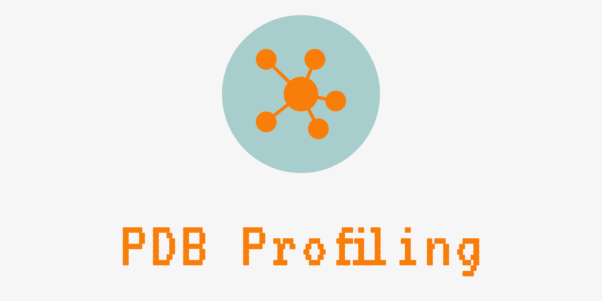
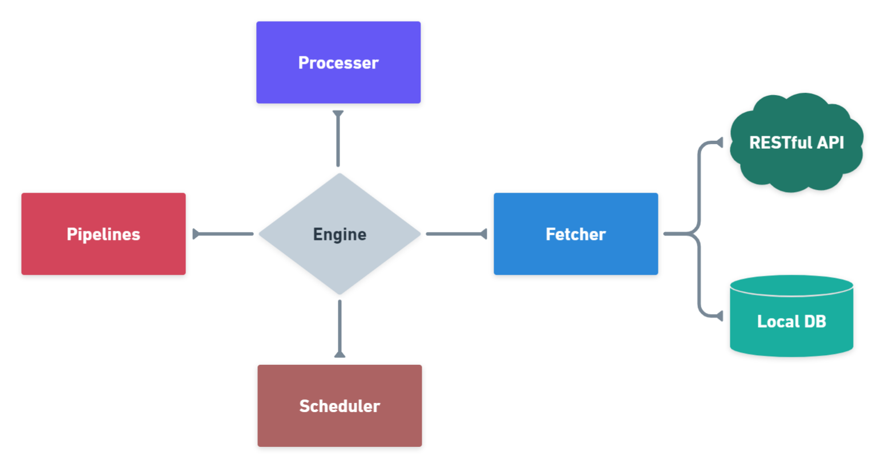
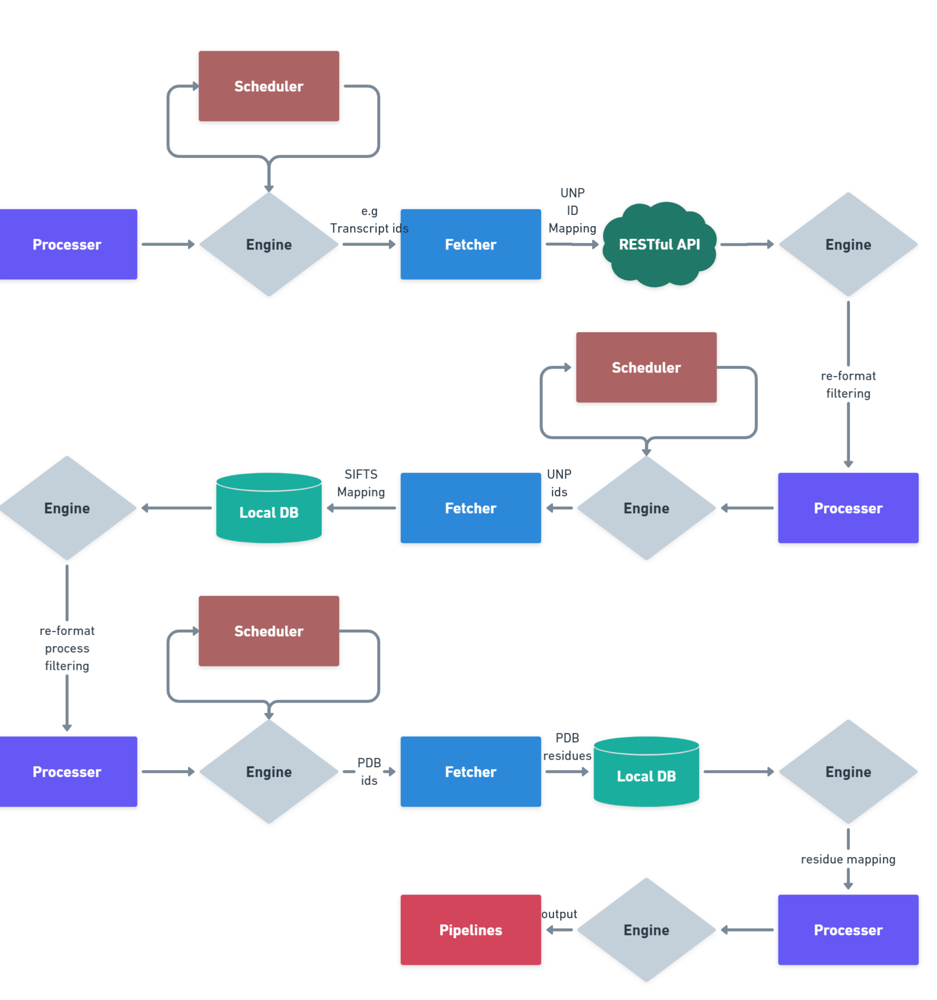

# pdb-profiling

Profiling Protein Structures from Protein Data Bank and integrate various resources.

## Goal

* Gather helpful/insightful indexes to evaluate a PDB structure's usefulness in:
  * Entry level
  * Model level (?)
  * Entity level
  * Chain level
  * Residue level
* Define the representative set of protein structures:
  * of a cluster with nearly identical sequences
  * of UniProt Entry
  * of UniProt Isoform
  * or any other assigned structure dataset
* Provide interface for ID/residue mapping
* Apply mature and robust API to collect well-organized data
  * Implement PDBe REST API (i.e <https://www.ebi.ac.uk/pdbe/api/doc/pdb.html>)
  * Implement PDBe Graph Database API (<https://www.ebi.ac.uk/pdbe/graph-api/pdbe_doc/>)
* Release this project as a Python package

## Architecture Design

* Processers
* Scheduler
* Fethcer
* Pipelines
* Engine
* Middlewares
  * Fetcher Middlewares
  * Processer Middlewares

Processer -> Scheduler -> Fetcher -> Processer/Pipelines -> Scheduler

### Processer

> "..." stands for "can be extended by users"

* Accept a stream of IDs and their ID TYPE
  * UniProt 
  * PDB
  * RefSeq Nucleotide/Transcript/Protein
  * Ensembl Gene/Transcript/Protein
  * ...
* Prepared with per-defined procedures to choose
  * Towards ID Mapping
    * via `UniProt Retrieve/ID mapping`
    * via `G2S`
    * ...
  * Access specified PDB Data
    * via PDBe API
    * via Local Neo4j DataBase
    * ...
* Accept results from the `fetcher` passed by the `engine` and decide whether to pass the results to the `pipelines` directly or keep the results and generate new requests according to the procedure to the `scheduler` until the results to be integrated enough to be passed
  * Deliver requests to the `engine` (towards the `scheduler`)
    * initial
    * in the process
  * Deliver results to the `engine` (towards the `pipelines`)

#### Learn from `Apache Airflow`

* Job Schedular
  * Multiple tasks
* Directed Acyclic Grapg (DAG)
* DAG Definition File

### Scheduler

It collects requests to be sent to `fetcher`.

* Accept requests from the `processer`  (initial or add in the process)
  * Accept a stream of IDs and their ID TYPE
  * Accept corresponding pathway settings from the choosen procedure
* Schedule the tasks with queue (offer/poll)
* Deliver the requests to the `engine` (towards `fetcher`)

### Fethcer

* Acceot requests from the `engine` (from the `scheduler`)
* Fetch data via Internet (RESTful API) or local DataBase as defined by requests
* Deliver results to the `engine` (towards the `processer`)

### Pipelines

* Accept results from the `engine` (delivered by the `processer`)
* Perform data curation
  * Integrate data
  * Filtering
  * Ranking/Sorting
  * Scoring
* Output results
  * database
  * file system

### Middlewares

#### Fetcher Middlewares

`Fetcher middlewares` are specific hooks that sit between the `Engine` and the `fetcher` and process requests when they pass from the `Engine` to the `fetcher`, and responses that pass from `fetcher` to the `Engine`.

* process a request just before it is sent to the `fetcher`
  * i.e., lowercase letter 
* silently drop some requests
  * i.e., drop invalid ids
* change received response before passing it to a `processer`
  * i.e., re-format?
* send a new Request instead of passing received response to a `processer`
  * i.e., 505 error...
* pass response to a `processer` without fetching data
  * i.e., none/nan/empty data

#### Processer Middlewares

`Processer middlewares` are specific hooks that sit between the `Engine` and the `processers` and are able to process `processer` input (responses) and output (items and requests).

Use a `processer middleware` if you need to:

* post-process output of `processer` callbacks - change/add/remove requests or items
* post-process start_requests
* handle spider exceptions
* call errback instead of callback for some of the requests based on response content

## Copyright Notice

This project is developed by [Zefeng Zhu](https://github.com/NatureGeorge) and hold by [Minghui Group](https://lilab.jysw.suda.edu.cn/).